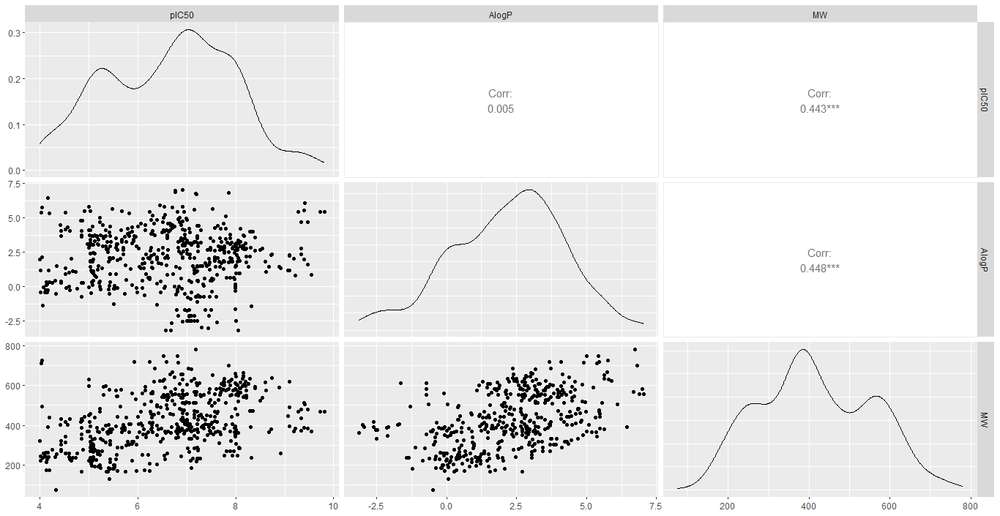
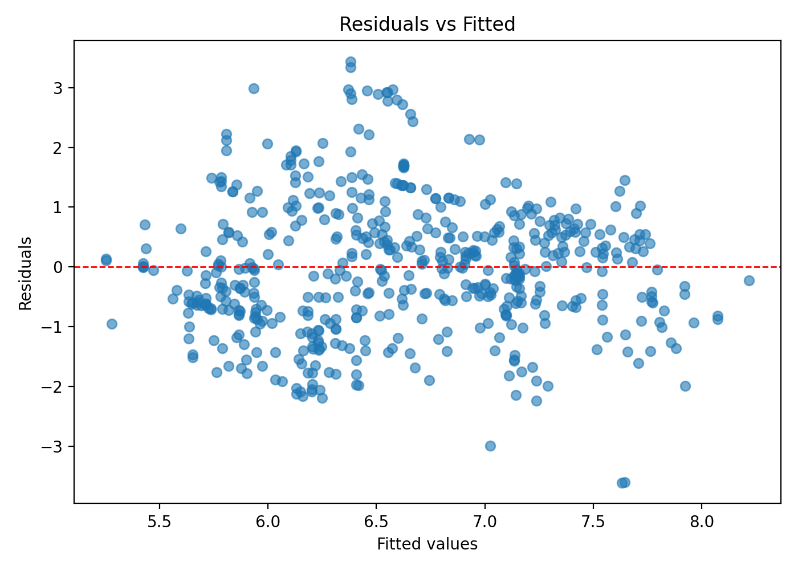

# Multivariate pIC50 modeling for Carbonic Anhydrase II (ChEMBL205) — OLS + diagnostics

**Goal:** Build a reproducible data science workflow to model **pIC50** for **Carbonic Anhydrase II (ChEMBL205)** using a **multiple linear regression (OLS)** with two molecular descriptors: **AlogP** (lipophilicity) and **Molecular Weight (MW)**.

📄 Full report (Spanish): `reports/reporte_P2.pdf`

---

## Why this matters (for a hiring manager)
- Shows progression from a weak baseline (Project 1) to a **multivariate model** with improved explanatory power.
- Includes **diagnostics** (collinearity, heteroscedasticity, influence) and proposes concrete next steps.
- Reproducibility: **Python-first workflow** + optional **R cross-check**.

---

## Executive summary
- Model: **pIC50 ~ AlogP + MW** (OLS)
- Outputs include: coefficients, R²/adjusted R², F-test, residual diagnostics, VIF, Cook’s distance, and Breusch–Pagan test.

---

## Key figures (EDA + diagnostics)






---

## Quickstart (Python)
Create the conda environment:

```bash
conda env create -f python/environment.yml
conda activate ca2-pic50-multivariate
```

**Important:** this project expects the curated dataset produced in Project 1.
Copy it into: `data/processed/ca2_curated.csv`

Run the pipeline:

```bash
python python/src/01_multivariate_eda.py
python python/src/02_fit_ols_multivariate.py
python python/src/03_diagnostics.py
```

---

## Notebooks (recommended for reading)
1. `notebooks/01_multivariate_eda.ipynb`
2. `notebooks/02_multivariate_ols.ipynb`
3. `notebooks/03_diagnostics_influence.ipynb`

---

## Outputs
- `results/ols_summary.txt`, `results/ols_params.csv`, `results/ols_metrics.csv`
- `results/vif.csv`, `results/breusch_pagan.json`, `results/influential_points.csv`
- `figures/` (EDA + diagnostics plots)

---

## Author
M. Osvaldo Hernández Montoya
